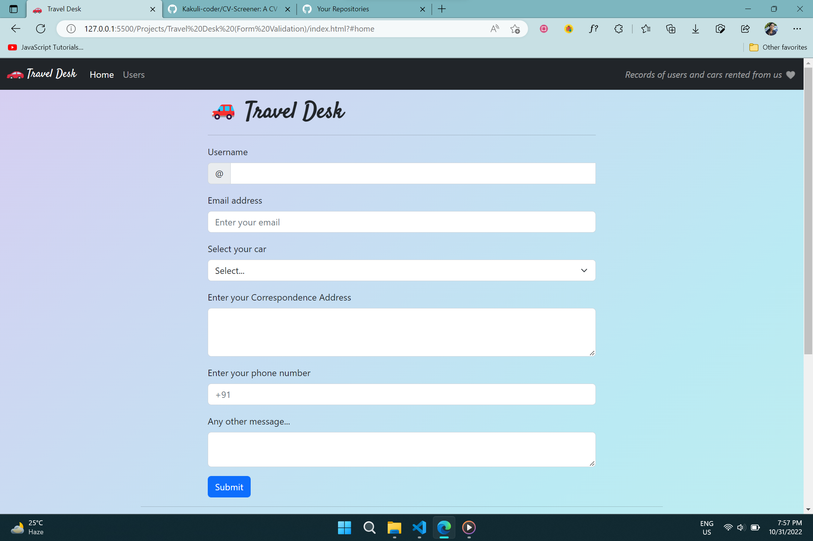
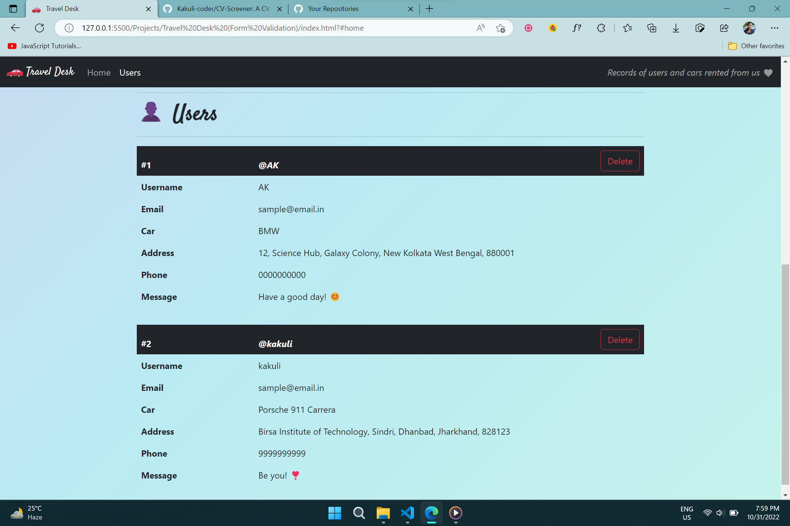

# 🚗 Travel Desk

Travel Desk is a website that displays *records of the users* who have rented car from the organization.  

Click <a href="https://Kakuli-coder.github.io/TravelDesk/" alt="Travel-Desk" target="_blank">here</a> to go to *Travel Desk* Website.  

Travel Desk Preview 👇

*(The website implements the concepts of 'Form Validation using Regular Expressions').*
